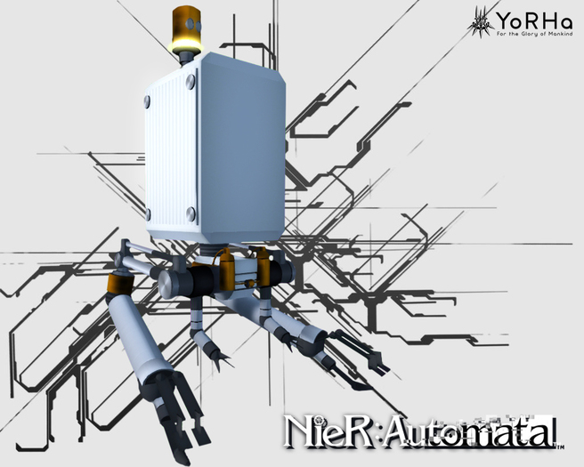
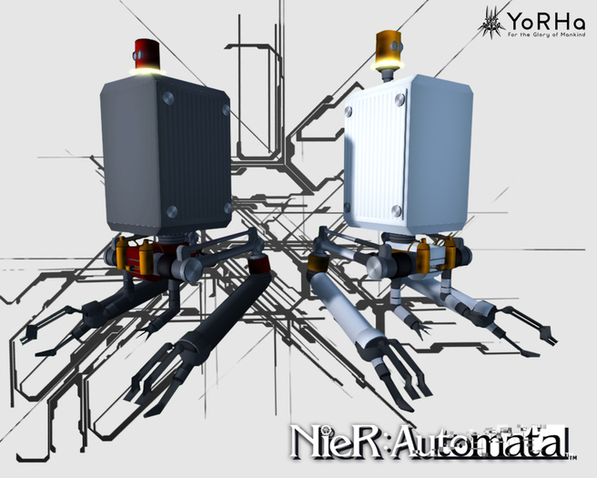
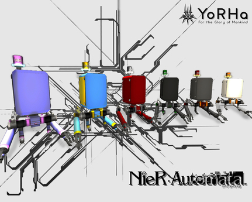
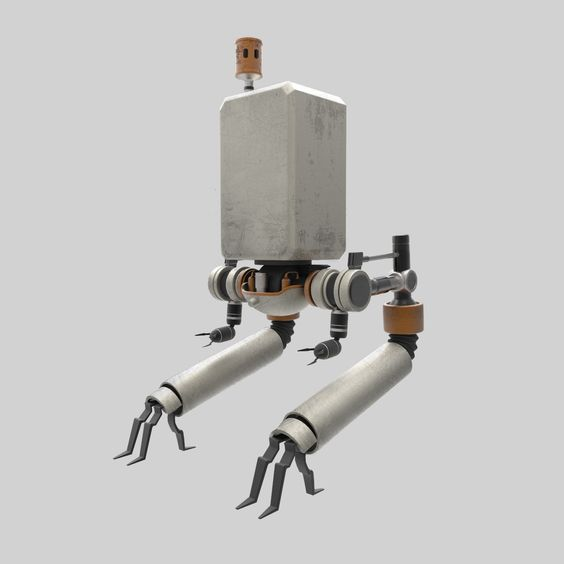
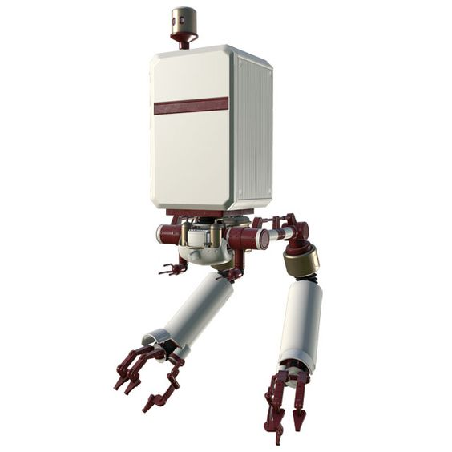
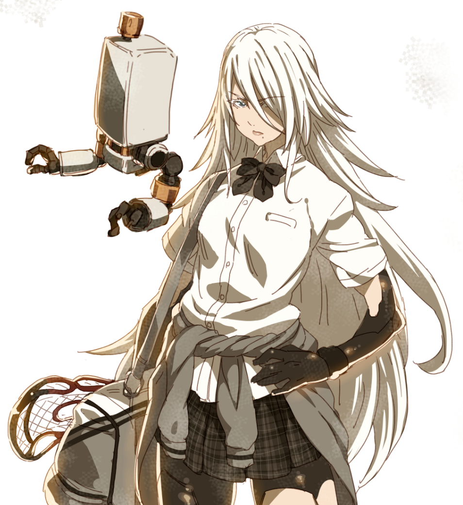
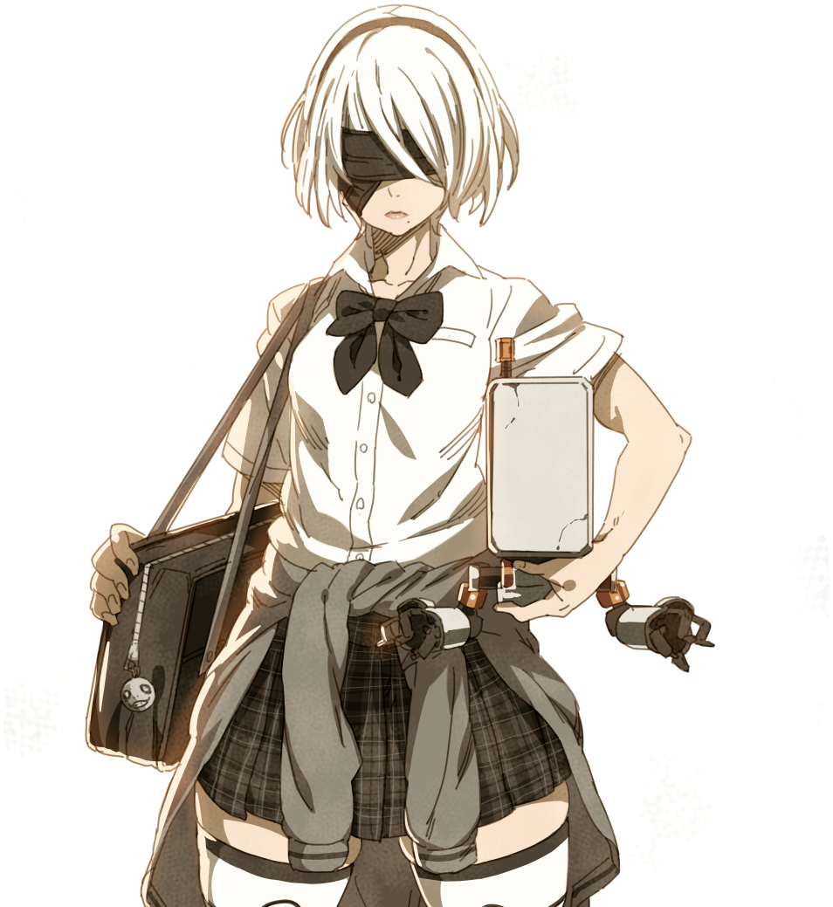
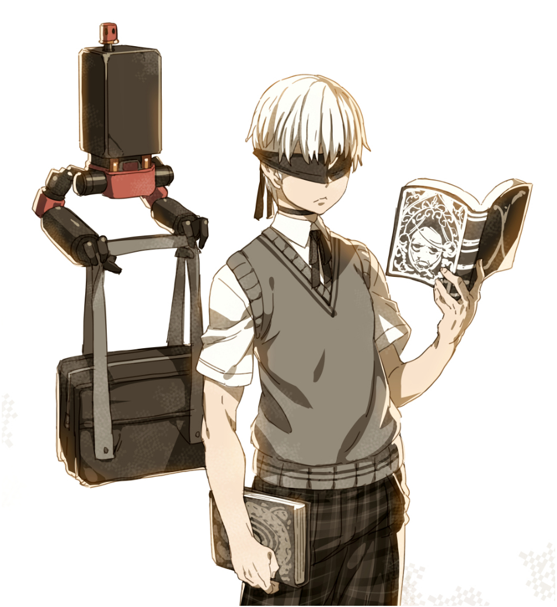

**\[UDD] Desarrollo Web Fullstack C13**

# Proyecto 03: Landing de Negocio

## Tabla de Contenidos

- [1. Introducción](#1-introducción)
- [2. Desarrollo](#2-desarrollo)
    - [2.1. `index.html`](#21-indexhtml)
    - [2.2. `styles.css`](#22-stylescss)
- [3. Pruebas](#3-pruebas)
- [4. Conclusión](#4-conclusión)
- [5. Referencias](#4-referencias)


# 1. Introducción
El proyecto consiste en una página de aterrizaje. El usuario debe acceder a la página, observar la interfaz y comprender de qué trata el negocio y sus productos.

Para esto, se utiliza el modelo de representación DOM:

```html
<!DOCTYPE html>
<html lang="es">
<head>
    <meta charset="UTF-8">
    <title>Ejemplo de DOM HTML</title>
</head>
<body>
    <h1>Este es un ejemplo de DOM HTML</h1>
    <p>El Document Object Model (DOM) es una representación del documento HTML.</p>
    <ul>
        <li>Permite acceder y manipular dinámicamente el contenido de la página.</li>
        <li>Cada elemento HTML es representado como un nodo en un árbol.</li>
        <li>Es fundamental para la creación de aplicaciones web interactivas.</li>
    </ul>
</body>
</html>
```

Utilizando como base este código y lo visto en clases, se agregan funcionalidades para cumplir los objetivos que se solicitan.


# 2. Desarrollo
El desarrollo del proyecto consta de 2 archivos principales
- `index.html`
- `style.css`

## 2.1. `index.html`

```html
<!DOCTYPE html>
<html lang="es">
<head>
    <meta charset="UTF-8">
    <meta name="viewport" content="width=device-width, initial-scale=1.0">
    <title>PodsLife</title>
    <link rel="stylesheet" href="style.css">
</head>
<body>
    <header>
        <div class="container">
            
            <h1>PodsLife</h1>
            <nav>
                <ul>
                    <li><a href="#features">Características</a></li>
                    <li><a href="#models">Modelos</a></li>
                    <li><a href="#reviews">Opiniones</a></li>
                    <li><a href="#contact">Contacto</a></li>
                </ul>
            </nav>
        </div>
    </header>

    <section id="hero">
        <div class="container">
            <h2>Tu Compañero Perfecto</h2>
            <p>Experimenta la tecnología avanzada de nuestros pods. Innovación y estilo en la palma de tu mano.</p>
            <a href="#models" class="btn">Explora Modelos</a>
        </div>
    </section>

    <section id="features">
        <div class="container">
            <h2>Características</h2>
            <div class="feature-list">
                <div class="feature-item">
                    
                    <h3>Asistencia Inteligente</h3>
                    <p>Los pods ofrecen asistencia inteligente para facilitar tus tareas diarias.</p>
                </div>
                <div class="feature-item">
                    
                    <h3>Conectividad Avanzada</h3>
                    <p>Conéctate con tus dispositivos de forma rápida y sencilla.</p>
                </div>
                <div class="feature-item">
                    
                    <h3>Diseño Futurista</h3>
                    <p>Un diseño que combina elegancia y funcionalidad.</p>
                </div>
            </div>
        </div>
    </section>

    <section id="models">
        <div class="container">
            <h2>Modelos Disponibles</h2>
            <div class="model-list">
                <div class="model-item">
                    
                    <h3>Pod Modelo A</h3>
                    <p>El modelo A ofrece una experiencia equilibrada con características avanzadas.</p>
                    <a href="#contact" class="btn">Comprar Ahora</a>
                </div>
                <div class="model-item">
                    
                    <h3>Pod Modelo B</h3>
                    <p>El modelo B está diseñado para aquellos que buscan el máximo rendimiento.</p>
                    <a href="#contact" class="btn">Comprar Ahora</a>
                </div>
                <div class="model-item">
                    
                    <h3>Pod Modelo C</h3>
                    <p>El modelo C combina estilo y tecnología para una experiencia única.</p>
                    <a href="#contact" class="btn">Comprar Ahora</a>
                </div>
            </div>
        </div>
    </section>

    <section id="reviews">
        <div class="container">
            <h2>Opiniones de Clientes</h2>
            <div class="review-list">
                <div class="review-item">
                    
                    <p>"PodsLife ha cambiado mi vida. Sus pods son increíblemente útiles y elegantes."</p>
                    <p><strong>- Angélica A2</strong></p>
                </div>
                <div class="review-item">
                    
                    <p>"Me encanta el diseño futurista y la funcionalidad de estos pods. ¡Totalmente recomendados!"</p>
                    <p><strong>- María 2B</strong></p>
                </div>
                <div class="review-item">
                    
                    <p>"Nunca pensé que un dispositivo como este podría ser tan útil en mi día a día. Estoy encantado."</p>
                    <p><strong>- Marcos 9S</strong></p>
                </div>
            </div>
        </div>
    </section>

    <section id="contact">
        <div class="container">
            <h2>Contacto</h2>
            <form>
                <div class="form-group">
                    <label for="name">Nombre:</label>
                    <input type="text" id="name" name="name" required>
                </div>
                <div class="form-group">
                    <label for="email">Correo Electrónico:</label>
                    <input type="email" id="email" name="email" required>
                </div>
                <div class="form-group">
                    <label for="message">Mensaje:</label>
                    <textarea id="message" name="message" rows="5" required></textarea>
                </div>
                <button type="submit" class="btn">Enviar</button>
            </form>
        </div>
    </section>

    <footer>
        <div class="container">
            <p>&copy; 2024 PodsLife. Todos los derechos reservados.</p>
        </div>
    </footer>
</body>
</html>
```

El archivo `index.html` contiene los elementos y sub-elementos necesarios para satisfacer los puntos del proyecto. Esto se logró mediante ensayo y error, además de ver distintos tutoriales y clases pre-grabadas del bootcamp.

La jerarquía extensa de elementos y cantidad de código es algo confusa al inicio. A medida que se va interiorizando con el proyecto es posible utilizar de mejor forma la asignación de 'clases', 'id' y tags semánticos. 

## 2.2. `styles.css`

```css
/*body section style*/
body {
    font-family: Arial, sans-serif;
    margin: 0;
    padding: 0;
    background-color: #f4f4f4;
    color: #333;
}

/*header-parent and child styles*/
header {
    background-color: #555353;
    color: #fff;
    padding: 10px 0;
}
header .container {
    display: flex;
    justify-content: space-between;
    align-items: center;
    max-width: 1200px;
    margin: 0 auto;
    padding: 0 20px;
}
header h1 {
    margin: 0;
    font-size: 60px;
}
header nav ul {
    list-style: none;
    margin: 0;
    padding: 0;
    display: flex;
}
header nav ul li {
    margin-left: 20px;
}
header nav ul li a {
    color: #fff;
    text-decoration: none;
    font-weight: bold;
}

/*id-parent 'hero' and child styles*/
#hero {
    background-image: url('images/banner.jpg');
    background-size: cover;
    background-position: center;
    color: #ffffff;
    padding: 100px 0;
    text-align: center;
}
#hero h2 {
    font-size: 48px;
    margin: 0;
}
#hero p {
    font-size: 24px;
    margin: 20px 0;
}
#hero .btn {
    background-color: #ff6347;
    color: #fff;
    padding: 10px 20px;
    text-decoration: none;
    border-radius: 5px;
    font-size: 18px;
}

/*id-parents 'features','models','reviews','contact' and their children styles*/
#features, #models, #reviews, #contact {
    padding: 60px 20px;
    background-color: #fff;
}
#features .container, #models .container, #reviews .container, #contact .container {
    max-width: 1200px;
    margin: 0 auto;
}
#features h2, #models h2, #reviews h2, #contact h2 {
    text-align: center;
    margin-bottom: 40px;
    font-size: 36px;
}
.feature-list, .model-list, .review-list {
    display: flex;
    justify-content: space-around;
    flex-wrap: wrap;
}
.feature-item, .model-item, .review-item {
    max-width: 30%;
    text-align: center;
    margin-bottom: 20px;
}
.feature-item img, .model-item img, .review-item img {
    max-width: 100%;
    border-radius: 5px;
}
.feature-item h3, .model-item h3 {
    font-size: 24px;
    margin: 20px 0 10px;
}
.feature-item p, .model-item p {
    font-size: 16px;
}
.model-item .btn {
    background-color: #ff6347;
    color: #fff;
    padding: 10px 20px;
    text-decoration: none;
    border-radius: 5px;
    font-size: 18px;
}
.review-item p {
    font-size: 16px;
    margin: 10px 0;
}
.review-item strong {
    display: block;
    margin-top: 10px;
}

/*id-parent 'contact' and child styles*/
#contact form {
    max-width: 600px;
    margin: 0 auto;
}
#contact .form-group {
    margin-bottom: 20px;
}
#contact .form-group label {
    display: block;
    margin-bottom: 5px;
}
#contact .form-group input, #contact .form-group textarea {
    width: 100%;
    padding: 10px;
    box-sizing: border-box;
}
#contact .btn {
    background-color: #ff6347;
    color: #fff;
    padding: 10px 20px;
    text-decoration: none;
    border-radius: 5px;
    font-size: 18px;
    display: block;
    margin: 0 auto;
    text-align: center;
}

/*footer-parent section and child style*/
footer {
    background-color: #222;
    color: #fff;
    padding: 10px 0;
    text-align: center;
}
footer .container {
    max-width: 1200px;
    margin: 0 auto;
    padding: 0 20px;
}
```

El archivo `style.css` permite presentar los elementos declarados en `index.html` con una apariencia visual agradable y atractiva para el cliente/consumidor. 

Permite ordenar los elementos mediante cajas, por medio del modelo de diseño `FlexBox`.

Se declaran distintos elementos con jerarquía `padres`. Éstos, traspasarán sus propiedades a sus respectivos `hijos`. 

# 3. Pruebas

Se realiza una publicación del proyecto, utilizando el servicio 'Github pages'.

<https://sauk1346.github.io/UDD_C13_Proyecto03/>

El link muestra el resultado final.

# 4. Conclusión
Este proyecto permitió entender la complejidad de diseñar una página que sea informativa, atractiva, y que no sature con mucha información.

Sinceramente es uno de los proyectos más dificiles hasta ahora, ya que no sólo implica programación, sino también habilidades blandas, habilidades de diseño gráfico, ingeniería social, y técnicas de marketing, necesarias para que el proyecto sea llamativo e interesante para los consumidores.

# 4. Referencias

- UDD Bootcamp Web FullStack, clases 09 a 12, Profesor [Brian Guzmán M.](https://cl.linkedin.com/in/brianguzman)
- Youtube@KikoPalomares: [Curso de FlexBox CSS desde Cero](https://www.youtube.com/watch?v=WaWSucOblUA&list=PLnunbwZjHqMPmEk0fj_QIqVjGK0Cb0C8Q)
- Excalidraw.com: [Pizarra online](https://excalidraw.com/)
- WikiHow: [Cómo agregar el símbolo de marca registrada HTML](https://es.wikihow.com/agregar-el-s%C3%ADmbolo-de-marca-registrada-en-HTML)
- Youtube@ProgramacionAccesible: [Cómo publicar un sitio web con Github pages](https://www.youtube.com/watch?v=sLTNgxxSBR4)
- ZeroChan: [Galería Imágenes VideoJuego 'Nier:Automata'](https://www.zerochan.net/2213614#full)